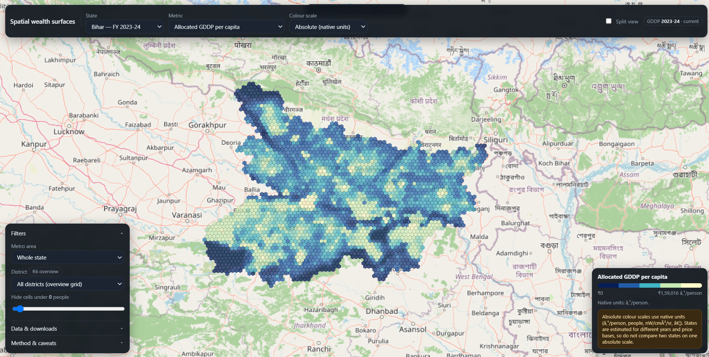

# 🗺️ Spatial GDDP Disaggregation

> **What:** Take a single officially-published district GDP number and distribute it across thousands of small hexagonal patches, weighted by satellite and map evidence — so that every patch's share sums back *exactly* to the original total.

---

## 🌐 Live Demo

**[→ Open the interactive map](https://raushan999.github.io/h3-spatial-wealth/)**



> The map above shows **Bihar, FY 2023-24** — each hexagon is a ~5 km² patch coloured by its estimated allocated GDDP per capita. Brighter cells = higher estimated economic activity. Use the filters panel (bottom-left) to switch state, metric, district, or colour scale.

**What you can do on the map:**

- Switch between states and fiscal years
- Toggle between *Allocated GDDP per capita* and *Wealth index percentile* views
- Filter by metro area or individual district
- Hide unpopulated cells with the population slider
- Download the underlying data via the *Data & downloads* panel

---


## The problem, in plain words

India publishes one economic number per district: **Gross District Domestic Product (GDDP)**. For example, Pune district's official GDDP for 2023–24 is:

$$
Y_{\text{Pune}} = ₹281{,}986 \text{ crore}
$$

That single number describes the *entire* district — a huge, mixed area with dense city cores, industrial belts, farmland, and sparse rural stretches. It cannot tell you which specific patch of land is economically active and which is not.

**The question this project answers:** if a district's total GDP is ₹281,986 crore, how is that money likely spread across the district's *5 km² patches of land*?

We call this **disaggregation** — splitting a known total into smaller, spatially located pieces that **add back up exactly** to the original total:

$$
\sum_{i \in \text{Pune}} GDP_i = Y_{\text{Pune}}
$$

where each $i$ is one small hexagonal patch of Pune, and $GDP_i$ is that patch's *estimated* share.

### What is actually measured vs. estimated


|                                                                       | Value                                      | Status                                                          |
| --------------------------------------------------------------------- | ------------------------------------------ | --------------------------------------------------------------- |
| District GDP                                                          | ₹281,986 crore                             | **Observed** — published by the state government                |
| Population, night lights, roads, buildings, shops, land use per patch | e.g. 9,585 people, 12.94 night-light units | **Observed** — satellite / survey / map data                    |
| GDP of one 5 km² patch                                                | e.g. ₹81.91 crore                          | **Estimated** — no such number is ever published; we compute it |


There is **no dataset anywhere that measures GDP at this fine a scale.** Everything at the patch level is an *educated allocation*, not a measurement. This is the single most important thing to understand about this project — we are not "discovering" true hyper-local GDP, we are proposing a plausible, constrained split of a known total.

---


## Why split by a 5 km² hexagon (H3)?

We needed a way to divide *any* district — regardless of its shape — into small, roughly equal-sized, comparable units. We use **H3**, an open hexagonal grid system (built by Uber), at a resolution where each cell covers about **5 km²**.

Why hexagons instead of squares or the messy shapes of villages/wards:

- Every cell is roughly the same size and shape, so patches are comparable across a whole state.
- Each cell has a fixed, well-defined neighbourhood (its 6 touching cells), which matters later.
- Cells naturally nest into larger parent cells (a form of zoom-out), which we also use.

Pune's district boundary, filled with this hexagon grid, produces **3,235 individual patches**. Each patch is one *unit* we must assign a GDP value to.

---


## What information do we have about each patch?

For every hexagon, we collect):

- **Population** living inside it
- **Night-time light brightness** (a satellite proxy for electrified, active areas)
- **Road length** running through it
- **Number and type of points of interest** — restaurants, banks, hospitals, malls, hotels, offices, etc.
- **Building footprint area and count**
- **Land-use mix** — how much of the patch is residential, commercial, industrial, or retail land

None of these are money. They are *circumstantial evidence* that a patch is more or less economically active — the same way a real-estate analyst might say "this area probably has higher property value because it has more shops, better roads, and brighter streets at night," without ever seeing a bank statement.

**Important limitation:** each signal is an imperfect and biased proxy.

- Night lights show electrified activity, not farming or informal daytime work.
- Roads and shop counts come from crowd-sourced maps, which are more complete in cities than villages.
- A brightly lit factory and a wealthy neighbourhood can look similar in raw light data.

---


## Why not just divide GDP by population share?

The simplest possible method: give each patch a share of GDP proportional to its population.

$$
GDP_i = Y_g \times \frac{population_i}{\sum_{j \in g} population_j}
$$

This assumes **every person in the district produces the same amount of economic value**, no matter where they live. That is a strong and often wrong assumption — a person living next to a business district plausibly contributes to (or benefits from) more surrounding economic activity than someone in a remote, low-activity village, even before considering their own income.

**We wanted a model that can also use the *other* signals** — lights, roads, shops, buildings, land use, and the character of the *surrounding* patches — so that two equally-populated patches, one bustling and one quiet, don't automatically get identical GDP shares.

That is the actual justification for this project's added complexity: **letting non-population evidence, including neighbourhood context, influence how the district total is split.**

---


## Why also look at neighbouring patches?

Economic activity does not stop cleanly at a hexagon's edge. A patch that itself has few shops but sits right next to a commercial hub is plausibly more active than an identical patch surrounded by farmland. So the method we use lets **each patch "borrow" information from the patches around it**, and from a broader zoomed-out region around it, before deciding how active that patch likely is.

This is done with a **Graph Neural Network (GNN)** — a model built to work on data connected like a network (here: hexagons connected to their touching neighbours, and to increasingly larger zoomed-out regions).

**A GNN is not moving money between patches.** No rupee is transferred from one hexagon to its neighbour. What is shared is *numeric evidence* — think of it as: "my neighbouring patches look this economically active, so maybe I should be corrected upward or downward too." Only after this evidence-mixing does the model produce one number per patch.

---


## How the model turns evidence into a number, and money appears

Because no patch has an observed GDP, the model cannot be shown "the correct answer" for any individual hexagon. Instead:

1. For every patch $i$, the model produces a raw, unit-less, non-negative **economic intensity** score:

$$
s_i \geq 0
$$

1. That score is multiplied by the patch's population to get a raw weighted contribution:

$$
z_i = s_i \times population_i
$$

1. All patches inside one district are added up to get that district's *predicted* total:

$$
\widehat{Y}*g = \sum*{i \in g} z_i
$$

1. This predicted total is compared against the *real, published* district GDP, $Y_g$. The comparison uses a squared error on a logarithmic scale (so a state with a ₹500,000 crore economy and one with a ₹10,000 crore economy are judged on *proportional* accuracy, not raw rupee difference):

$$
\text{loss} = \frac{1}{|G|}\sum_{g \in G} \Big(\log_{10}\widehat{Y}*g - \log*{10}Y_g\Big)^2
$$

1. The model's internal parameters are then nudged, repeatedly, so that its predicted district totals get closer to the real ones. This is standard neural-network training (forward pass → compare to target → backpropagate error → update parameters → repeat for many rounds).

**This is the answer to "where does money come from if the model never saw real GDP for a single hexagon?"** — the model is *only ever graded on whether its patch-level guesses, once summed up, reproduce the real district total.* It never sees a rupee value at the patch level, only at the district level, and only as a sum-check.

This means the model can freely be *wrong* about how the money is split *within* a district, as long as its overall district total is close. That is the central honest limitation of this approach — explained further below.

---


## From model score to final rupee value

The model's raw score $s_i$ alone will not sum exactly to the real district GDP — training makes it *close*, not *exact*. So one final, purely arithmetic step is applied per district, with no learning involved:

$$
k_g = \frac{Y_g}{\displaystyle\sum_{i \in g} s_i \times population_i}
$$

This is a single correction number per district: *how much do we need to scale up or down the model's raw output so the district adds up perfectly to the real number.*

Then, every patch's final GDP is:

$$
GDP_i = s_i \times population_i \times k_g
$$

Because $k_g$ is the *same number for every patch in a district*, it does not change how the district's money is *distributed* between patches — it only rescales all of them together so they add up correctly:

$$
\sum_{i \in g} GDP_i = Y_g \quad \text{(guaranteed by construction, every time)}
$$

**This exact match is not evidence the model is accurate.** It is simple arithmetic — dividing a fixed total proportionally by whatever raw scores the model produced. A district's cells summing correctly to its known total is *guaranteed by the formula*, not *earned by good predictions*.

Finally, dividing by population gives a per-person value, and ranking every patch in the state by that value (from lowest to highest) gives a **percentile score between 0 and 100** — this is what the map calls `wealth_index`. It is **not** a household wealth survey score; it is purely a rank of this project's own estimated GDP-per-person.

---


## What the model actually learns vs. what is just arithmetic


| Learned by the model (from data + training)                                                     | Fixed arithmetic (no learning)                           |
| ----------------------------------------------------------------------------------------------- | -------------------------------------------------------- |
| How much population, lights, roads, shops, buildings, land use, and neighbouring patches matter | The per-district correction factor $k_g$                 |
| The raw intensity score $s_i$ for every patch                                                   | Multiplying $s_i \times population_i \times k_g$         |
| —                                                                                               | Forcing every district's patches to sum exactly to $Y_g$ |
| —                                                                                               | Ranking patches into a 0–100 percentile                  |


---


## The honest, central limitation

A district with, say, 3,000 patches only has **one** real number to check the model against (its total GDP). That single equation:

$$
\sum_{i \in g} GDP_i = Y_g
$$

has **infinitely many possible correct-looking solutions** — many completely different ways of splitting money between 3,000 patches would all satisfy this one equation equally well. The features, the neighbourhood-sharing, and the training process all influence *which one* particular split the model lands on — but none of them *prove* that split is the real one, because **the real, true split at this fine a scale has never been measured, by anyone, anywhere, in this data.**

This is why:

- The model's within-district pattern should be treated as a *plausible, evidence-informed guess*, not a verified measurement.
- Any evaluation done on district-level totals (including this project's own checks) can look reassuring while saying almost nothing about whether the *split inside* each district is right.
- Cross-checking model output against the same satellite/OSM signals it was trained on (e.g. "our wealth score is correlated with night lights") is expected and mild supporting evidence at best — not independent proof, since those same signals were fed into the model.

If someone asks *"how do we know the hexagon-level numbers are correct?"* — the honest answer is: **we don't, not directly.** We know the district totals are correct, because that's the one number the whole process was built to reproduce.

---


## Data sources


| Data                                              | What it gives us                                 | Source                                                                                                                                                           |
| ------------------------------------------------- | ------------------------------------------------ | ---------------------------------------------------------------------------------------------------------------------------------------------------------------- |
| District GDDP (the only real money figure)        | One total per district, per state                | Respective state's Directorate of Economics & Statistics / Economic Survey, mostly retrieved via [OpenCity](https://data.opencity.in/) or official state portals |
| District & state boundaries                       | Shapes used to build the hexagon grid            | [geoBoundaries](https://www.geoboundaries.org/)                                                                                                                  |
| Population per hexagon                            | People living in each patch                      | [Kontur Population (via HDX)](https://data.humdata.org/dataset/kontur-population-india); [WorldPop](https://www.worldpop.org/) as an alternate option            |
| Night-time lights                                 | Proxy for electrified/active areas               | [VIIRS VNL night-lights, EOG / Payne Institute](https://eogdata.mines.edu/products/vnl/)                                                                         |
| Roads, buildings, land use, shops/services (POIs) | Physical and commercial infrastructure per patch | [OpenStreetMap](https://www.openstreetmap.org/), extracted via [Geofabrik](https://download.geofabrik.de/)                                                       |


None of these sources contain a GDP figure smaller than "one district." The GDP number itself always comes only from the official government table.

---


## Running the project (to reproduce or add a new state)

Install requirements once:

```bash
python -m pip install -r requirements.txt
```

See all configured states, then run one:

```bash
python run_state.py --list-states
python run_state.py --state MH
```

Common adjustments:

```bash
python run_state.py --state MH --epochs 50 --seeds 0 1 2 3 4 --population kontur
```

- `--epochs` — how many training rounds to run.
- `--seeds` — how many independent random re-runs to average over (used to show a min–max range on outputs).
- `--population` — switch between `kontur` (default) and `worldpop` as the population source.
- `--skip-eval` — skip the extra evaluation runs (faster, if you only want the main output).

Regenerate the interactive web map after any run:

```bash
python web/prepare_data.py
python -m http.server 8000 --directory web
```

Then open `http://localhost:8000` in a browser.

For the deep, code-level walkthrough — file-by-file, function-by-function, full worked maths, the exact graph/neural-network structure, and a discussion of every known weakness — see **[docs/METHOD.md](docs/METHOD.md)**.